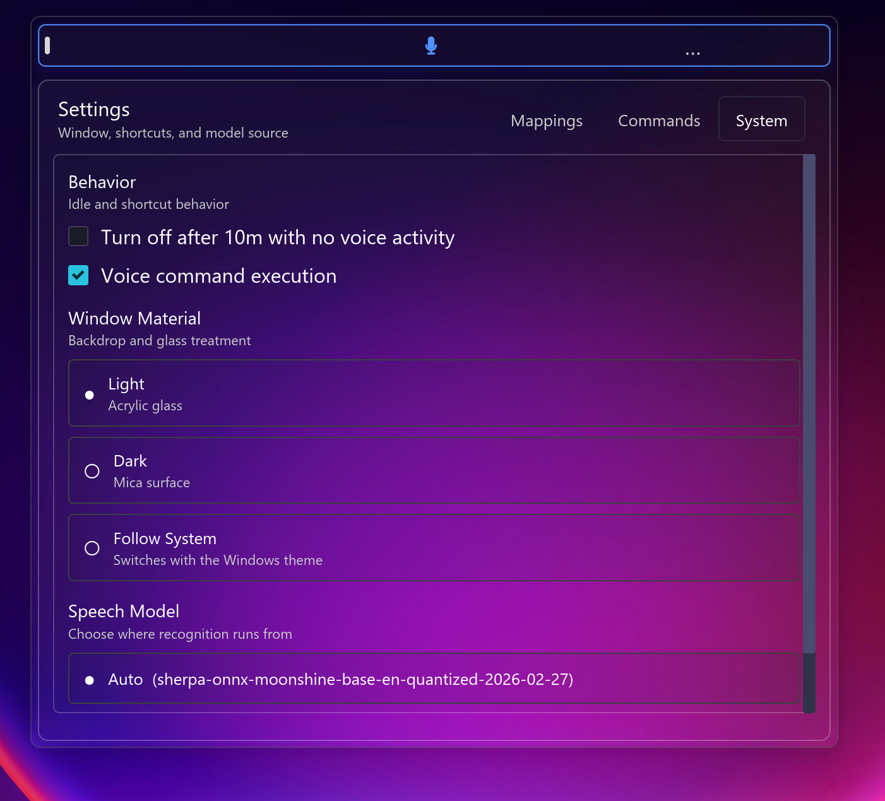

<h3 align="center">voice-typing</h3>

<p align="center">
Fast local voice typing for any focused window or browser input.
</p>

---

<p align="center">
  
</p>

`voice-typing` is a Rust desktop app that listens to your microphone, transcribes speech on-device with Sherpa-ONNX + Moonshine, and types final text into the currently focused app.

## Preview

<p align="center">
  
</p>

<table>
  <tr>
    <td align="center">
      
    </td>
    <td align="center">
      
    </td>
  </tr>
  <tr>
    <td align="center">Compact acrylic widget</td>
    <td align="center">System settings, mappings, and commands</td>
  </tr>
</table>

## Current Runtime

- ASR model: `sherpa-onnx-moonshine-base-en-quantized-2026-02-27`
- Segmentation: Silero VAD
- Microphone capture: CPAL with resample/downmix to 16 kHz mono
- Injection: Windows-focused system text injection into the active window
- Browser support: optional Chrome and Safari overlays via `--features extensions`

## What Was Tuned

- smaller live microphone chunks for faster VAD turnover
- tighter VAD silence thresholds and shorter utterance caps
- less aggressive gain shaping for better short-phrase stability
- tiny decode tail padding to reduce clipped word endings
- bounded audio queue trimming so latency does not drift upward
- 30 ms UI polling for faster final-text injection
- watchdog-based session recovery when the mic stream stalls
- 10-minute idle auto-off if nothing useful is heard

## Command Support

- `bang bang` sends Enter
- `new line` and `press enter` send Enter
- custom spoken-term rewrites are loaded from `user_dictionary.txt`

## Build

```bash
cargo run
```

root `cargo build` now targets the desktop app by default; use `cargo build --workspace` if you want every publishable crate.

## Install

- Releases publish Linux and macOS archives plus Windows packages.
- Windows packaging includes an MSI via `scripts/build-msi.ps1`.

## Build With Browser Extensions

```bash
cargo run --features extensions
```

extensions are written to `target/debug/extensions/chrome/` and `target/debug/extensions/safari/`

load the chrome extension unpacked from `chrome://extensions`

## CLI Mode

```bash
cargo run -- --nogui mic
cargo run -- --nogui wav path/to/file.wav
```

## Notes

- Everything runs locally. No cloud ASR service or API keys are required.
- The current typing path prioritizes fast, stable final-text commits over streaming partials.
- Wakeword and speaker diarization are not part of the current runtime path.
